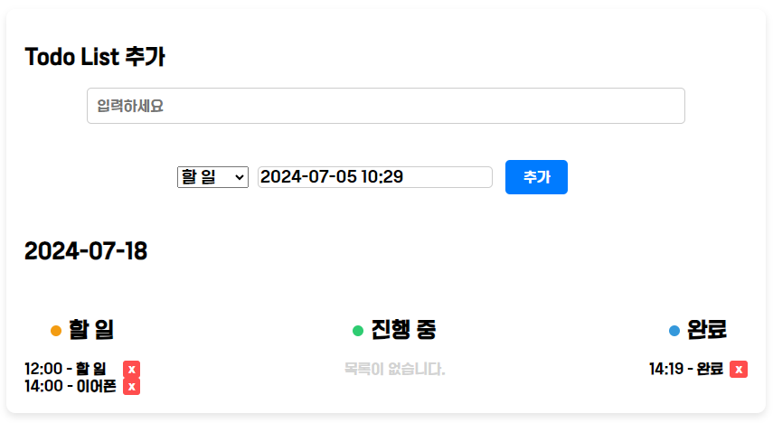
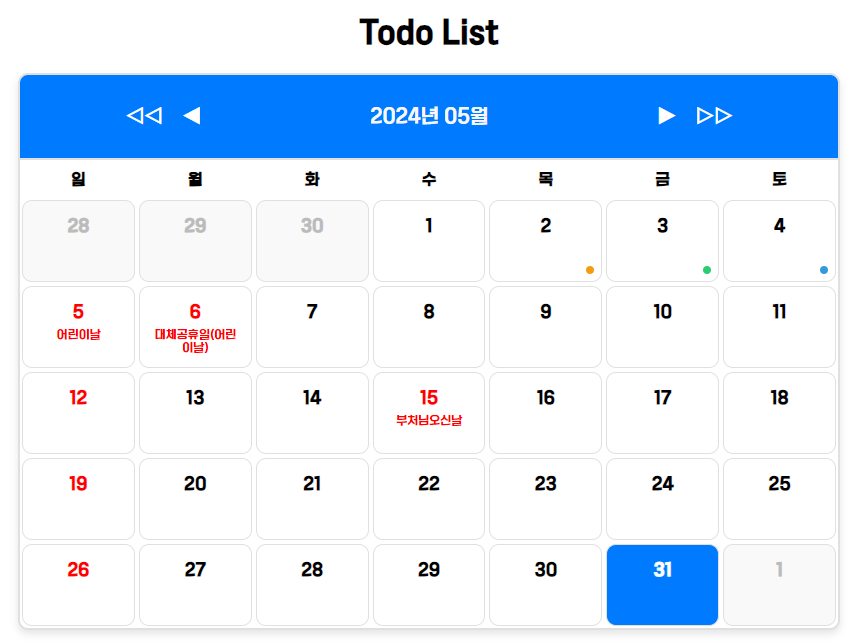

# TodoList Calendar

---

### npm 라이브러리

- axios
- date-fns : 날짜 형식을 한글로 변경
- react-datepicker : 날짜 및 시간을 선택

---

### 기능

- 할 일 / 진행 중 / 완료 3가지로 나누어 작성

- 캘린더에 각각 색을 지정해 날짜 아래에 점으로 표시

- 공공데이터 공휴일 API를 이용해 캘린더에 숫자와 이름 적용

  예시)
  
